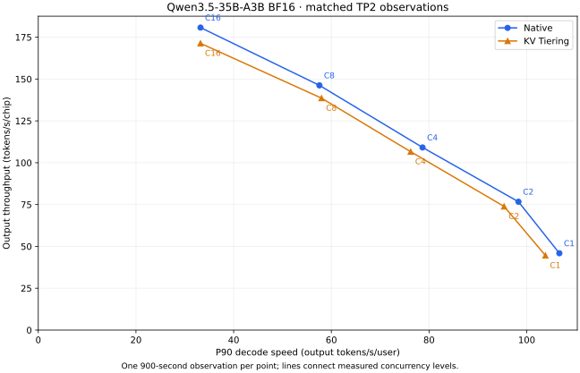

# KV Tiering 同配置对照：Qwen3.5-35B-A3B

本表和曲线均来自真实在线运行，每点为一次 900 秒观测，未拼接不同窗口的指标。 Native 与 Tiering 使用相同的 Host 修复和运行配置：BF16、TP2、256K 上下文、
APC、MTP2、异步调度、FULL_AND_PIECEWISE、max-seqs 16、batch-tokens 4096， 每卡 KV 预算 26,038,239,232 字节。Tiering
另使用 8 GiB CPU 层及文件存储。

两组分别通过 26 项检索检查和前缀复用检查，再依次测 C1/2/4/8/16；档位之间不重置缓存。 这不是一般答案质量认证。吞吐仅计正式窗口内 token，传输计数包含在途请求收尾。
一次观测的差异不能证明稳定加速；NPU/CPU 恢复字节也不能单独证明磁盘命中或性能收益。

| 并发 | Native 总吞吐 tok/s | Tiering 总吞吐 tok/s | 吞吐差 | 恢复 MiB | Tiering 传输状态 |
| ---: | ------------------: | -------------------: | -----: | -------: | ---------------- |
|    1 |               91.81 |                89.14 | -2.90% |     0.00 | 仅保存           |
|    2 |              153.35 |               147.75 | -3.66% |     0.00 | 仅保存           |
|    4 |              218.23 |               213.15 | -2.33% |     0.00 | 仅保存           |
|    8 |              292.43 |               277.15 | -5.23% |     0.00 | 仅保存           |
|   16 |              361.49 |               342.69 | -5.20% |     0.00 | 仅保存           |

原始证据：

- native:
  [运行清单](../reports/frontier-managed-tiering-20260926/metadata-native.json.gz)、[检索与释放回执](../reports/frontier-managed-tiering-20260926/native-qualification.json)、[检索原始响应](../reports/frontier-managed-tiering-20260926/native-retrieval.json.gz)
- native C1:
  [请求与流式 token 时刻](../reports/frontier-managed-tiering-20260926/native-c1-requests.jsonl.gz)、[计数起点](../reports/frontier-managed-tiering-20260926/native-c1-before.prom)、[计数终点](../reports/frontier-managed-tiering-20260926/native-c1-after.prom)
- native C2:
  [请求与流式 token 时刻](../reports/frontier-managed-tiering-20260926/native-c2-requests.jsonl.gz)、[计数起点](../reports/frontier-managed-tiering-20260926/native-c2-before.prom)、[计数终点](../reports/frontier-managed-tiering-20260926/native-c2-after.prom)
- native C4:
  [请求与流式 token 时刻](../reports/frontier-managed-tiering-20260926/native-c4-requests.jsonl.gz)、[计数起点](../reports/frontier-managed-tiering-20260926/native-c4-before.prom)、[计数终点](../reports/frontier-managed-tiering-20260926/native-c4-after.prom)
- native C8:
  [请求与流式 token 时刻](../reports/frontier-managed-tiering-20260926/native-c8-requests.jsonl.gz)、[计数起点](../reports/frontier-managed-tiering-20260926/native-c8-before.prom)、[计数终点](../reports/frontier-managed-tiering-20260926/native-c8-after.prom)
- native C16:
  [请求与流式 token 时刻](../reports/frontier-managed-tiering-20260926/native-c16-requests.jsonl.gz)、[计数起点](../reports/frontier-managed-tiering-20260926/native-c16-before.prom)、[计数终点](../reports/frontier-managed-tiering-20260926/native-c16-after.prom)
- tiering:
  [运行清单](../reports/frontier-managed-tiering-20260926/metadata-tiering.json.gz)、[检索与释放回执](../reports/frontier-managed-tiering-20260926/tiering-qualification.json)、[检索原始响应](../reports/frontier-managed-tiering-20260926/tiering-retrieval.json.gz)
- tiering C1:
  [请求与流式 token 时刻](../reports/frontier-managed-tiering-20260926/tiering-c1-requests.jsonl.gz)、[计数起点](../reports/frontier-managed-tiering-20260926/tiering-c1-before.prom)、[计数终点](../reports/frontier-managed-tiering-20260926/tiering-c1-after.prom)
- tiering C2:
  [请求与流式 token 时刻](../reports/frontier-managed-tiering-20260926/tiering-c2-requests.jsonl.gz)、[计数起点](../reports/frontier-managed-tiering-20260926/tiering-c2-before.prom)、[计数终点](../reports/frontier-managed-tiering-20260926/tiering-c2-after.prom)
- tiering C4:
  [请求与流式 token 时刻](../reports/frontier-managed-tiering-20260926/tiering-c4-requests.jsonl.gz)、[计数起点](../reports/frontier-managed-tiering-20260926/tiering-c4-before.prom)、[计数终点](../reports/frontier-managed-tiering-20260926/tiering-c4-after.prom)
- tiering C8:
  [请求与流式 token 时刻](../reports/frontier-managed-tiering-20260926/tiering-c8-requests.jsonl.gz)、[计数起点](../reports/frontier-managed-tiering-20260926/tiering-c8-before.prom)、[计数终点](../reports/frontier-managed-tiering-20260926/tiering-c8-after.prom)
- tiering C16:
  [请求与流式 token 时刻](../reports/frontier-managed-tiering-20260926/tiering-c16-requests.jsonl.gz)、[计数起点](../reports/frontier-managed-tiering-20260926/tiering-c16-before.prom)、[计数终点](../reports/frontier-managed-tiering-20260926/tiering-c16-after.prom)

指标和原始请求 SHA256 见 [逐点证据](../data/leaderboard_frontier_swe_evidence.json)。
修复来源：[Tiering PR #3](https://github.com/vLLM-HUST/vllm-hust-kv-tiering/pull/3)、
[Host #40](https://github.com/vLLM-HUST/vllm-hust/issues/40)。

独立从流式时刻复算吞吐、P90 decode、P95 TTFT
及实际并发：[10 点复算回执](../reports/frontier-managed-tiering-20260926/latency-audit.json)。

[测量与校验脚本](https://github.com/vLLM-HUST/vllm-hust-dev-hub/tree/de69d361ffff2acdd049fe1ce2787169e24eaa93/scripts/frontier_tiering)保留了完整窗口、匹配参数和释放检查。
