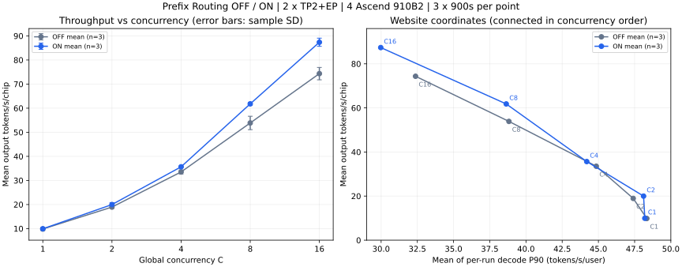

# Prefix Routing：C1–C16 三轮均值

## 测量口径

来自 pr173-dev4-c1-c16-3r-20261006 的 30 个有效 SWE 测量窗口。每组 C1/C2/C4/C8/C16，OFF/ON 各三轮，每轮 900 秒。两条线共 10
个点，每个指标都对同一组三轮作等权算术平均；没有选最佳轮，也没有分别选择最佳横纵坐标。保留每轮指标、样本标准差、最小值、最大值、run ID 和原始文件 SHA256。

网站横轴为每轮请求 decode P90 的三轮均值，纵轴为总吞吐量三轮均值除以全部 4 张卡。TTFT/TPOT/E2E P95 同样是“每轮 P95 的平均”，不是合并请求后的总体
P95。吞吐提升采用均值之比 ON_mean/OFF_mean−1，与原 paired-comparison.json 的逐对收益平均口径不同。

配置为 Qwen3.5-35B-A3B BF16，4×Ascend 910B2，两个独立 TP2+EP 副本，每副本 max_num_seqs=16、memory
utilization=0.65、上下文容量262144、APC启用、Mamba align。utility-victim 全程关闭。入口采用原 keepalive 策略。OFF
是同部署的随机路由对照，不是无代理或两卡官方基线。

## 性能结果

|   C |    OFF TPS |     ON TPS | ON/OFF−1 | OFF TPS/卡 | ON TPS/卡 | OFF P90均值 | ON P90均值 |
| --: | ---------: | ---------: | -------: | ---------: | --------: | ----------: | ---------: |
|   1 |  39.369630 |  39.745926 |   +0.96% |   9.842407 |  9.936481 |   48.341174 |  48.203857 |
|   2 |  75.798889 |  79.961481 |   +5.49% |  18.949722 | 19.990370 |   47.401244 |  48.116492 |
|   4 | 134.140370 | 142.651111 |   +6.34% |  33.535093 | 35.662778 |   44.850984 |  44.192917 |
|   8 | 215.477778 | 247.199259 |  +14.72% |  53.869444 | 61.799815 |   38.824028 |  38.635217 |
|  16 | 297.392963 | 349.489630 |  +17.52% |  74.348241 | 87.372407 |   32.374924 |  29.973527 |

## 机制与性能关联

|   C | ON 命中决策均值 | OFF 原生缓存命中率均值 | ON 原生缓存命中率均值 | OFF TTFT P95均值(ms) | ON TTFT P95均值(ms) |
| --: | --------------: | ---------------------: | --------------------: | -------------------: | ------------------: |
|   1 |           68.00 |                 79.63% |                87.39% |              2308.24 |              734.08 |
|   2 |          119.33 |                 83.03% |                89.85% |               902.83 |              782.87 |
|   4 |          193.33 |                 84.34% |                91.53% |              1122.04 |              905.51 |
|   8 |          343.33 |                 71.10% |                91.35% |              4804.30 |              973.36 |
|  16 |          415.33 |                 16.71% |                49.67% |              5229.62 |             3726.23 |

上述 MOD
命中决策是缓存索引匹配，并已与本地runtime-evidence核对。原生缓存命中率是随包analysis报告的值：来自两个副本的查询/命中计数差值，先在每轮内求比值，再对三轮平均。但本地多份原始prom文件为空且与封存SHA256不符，无法独立复核这些缓存率，不能把它们作为已验证的原生命中证据。缺损清单保存在证据JSON的source_integrity_issues中。计数覆盖客户端调用及drain，MOD计数覆盖本轮新进程生命周期，和严格900秒吞吐窗口并不完全一致。可以描述机制记录与性能变化同时出现，不能证明逐请求因果关系；OFF没有MOD决策不代表没有原生APC命中。

正例 C1/C8/C16
均有三对完整结果，ON命中决策分别为[361,361,361]、[351,353,361]、[341,330,336]，原分析的配对吞吐收益均值约5.01%、17.91%、24.86%。负例实验有7个缺失或无效单元，不能声明完整机制正负例门控通过。close-diagnostic
本地目录只有 evidences，没有 results，不计入任何平均，也不能补齐负例。

## 门控及发布边界

P-G1、P-G3仍缺历史证据；P-G2负例未完整；P-G4仅C8/C16为原脚本的收益候选，尚需质量和完整SLO审查；P-G5不能由均值线宣称全局Pareto通过。工程G1–G5保留原证据中的待核对状态，不因生成曲线自动通过。

本地网站已接入两条三轮均值曲线，跨campaign模型身份和性能门控仍待确认。已复算30轮逐请求记录并核对测量、开关、归属和性能原始文件的封存SHA256；prom缺损单独列出，不宣称整包完整。这不替代独立硬件执行。模型实际文件哈希保存在证据JSON，尚未证明与网站canonical
revision等价。prepared workload哈希匹配网站已登记变体，但tokenizer fingerprint差异及历史来源限制仍需保留。按用户要求在现有Qwen3.5
SWE视图中呈现，并在点证据中保留模型身份未确认状态；不据此确认跨campaign等价。未发布网站，未声称所有门控通过。

## 网站接入和验证

参照 [PR #339](https://github.com/vLLM-HUST/vllm-hust-website/pull/339/files) 的数据、证据、文档、测试结构接入。
`data/leaderboard_frontier.json` 保存10个均值点；`data/leaderboard_frontier_swe_evidence.json`
的30条记录各自保存原始summary/client/metrics，以三个真实run_id关联一个均值point_id。
`data/leaderboard_prefix_routing_mean_evidence.json` 补充逐轮指标、标准差、源文件核验和机制证据缺损清单。

测量开始日期跨2026-10-05至2026-10-06 UTC；弹窗显示范围，下载保留每轮run_id及均值统计。
页面默认显示OFF/ON两组，并明确标注三轮均值。下图左侧误差棒为三轮样本标准差，不是置信区间。



验证命令：

```bash
node --test tests/leaderboard_frontier_model.test.cjs
node scripts/verify_prefix_routing_browser.cjs
```

浏览器验证需要Playwright及Chromium；可通过环境变量`PLAYWRIGHT_CHANNEL=msedge`使用已安装的Edge。覆盖1440px和390px、两条曲线、10个点、日期范围、均值说明和逐点下载内容。
