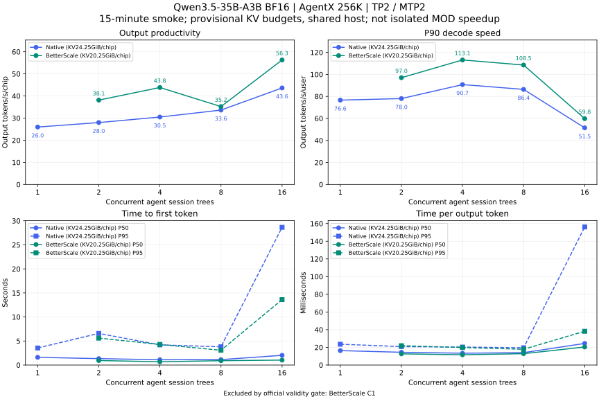

# Qwen3.5-35B-A3B: concurrency and provisional-capacity smoke

**900-second smoke only; one observation per point, not a formal window or quality score.**

## Accepted observations

| Engine / MOD             |   C | Output tokens/s/chip | P90 decode tokens/s/user | TTFT P50 / P95 (ms) | TPOT P50 / P95 (ms) |
| ------------------------ | --: | -------------------: | -----------------------: | ------------------: | ------------------: |
| BetterScale experimental |   2 |               38.135 |                   97.009 |      940.9 / 5606.6 |     12.676 / 21.899 |
| BetterScale experimental |   4 |               43.838 |                  113.125 |      684.7 / 4289.4 |     11.615 / 19.799 |
| BetterScale experimental |   8 |               35.207 |                  108.501 |      908.8 / 3075.1 |     12.867 / 17.853 |
| BetterScale experimental |  16 |               56.280 |                   59.833 |    1032.6 / 13607.9 |     20.428 / 38.215 |
| Native                   |   1 |               25.975 |                   76.635 |     1607.4 / 3551.9 |     16.339 / 23.555 |
| Native                   |   2 |               27.997 |                   78.049 |     1338.3 / 6584.1 |     14.460 / 20.875 |
| Native                   |   4 |               30.488 |                   90.748 |     1104.8 / 4190.1 |     13.379 / 20.347 |
| Native                   |   8 |               33.630 |                   86.376 |     1130.0 / 3802.9 |     14.026 / 19.538 |
| Native                   |  16 |               43.635 |                   51.452 |    2025.6 / 28646.3 |    24.468 / 156.103 |

## Contract and interpretation

- Same fixed AgentX 256K smoke protocol, dataset, seed and AL2.63 as the
  [initial C4 pair](FRONTIER-QWEN35-AGENTX-SMOKE.md). Each point starts a fresh server; no workload
  filtering or window extension.
- vLLM 0.25.1 / vLLM-Ascend 0.25.1rc1; base commits and sampler calibration remain in the
  [metric extract](../data/leaderboard_frontier_evidence.json). BF16 weights/KV, TP2, MTP2, 262144
  context, server max-seqs16, query budget4096, no host KV offload.
- Native: 24.25 GiB KV/chip; BetterScale: 20.25 GiB KV/chip. Explicit bytes override utilization.
  Capture-related free-memory deltas were approximately 3.37 GiB for FULL versus native 0.48 GiB,
  not an exact graph-pool allocation inventory. Higher tested FULL budgets failed before serving.
  These are validated provisional working budgets, not proven maxima or equal-KV/MOD-only controls.
- A subsequent read-only source audit found draft dummy sampling derives 1365 rows from a 4096-token
  warmup despite max-seqs16; the request cap applies only to profiling. This matches the 648 MiB
  logits allocation failure in the higher-budget FULL warmup. The frozen runs retain this padding;
  it is not an inevitable FULL memory cost. No padding fix or recovered-capacity measurement is
  included in these results.
- Three shared-host physical TP2 pairs: C1/C2, C4/C8 and C16. Both arms of each load use the same
  pair sequentially. Different loads can have different pairs and colocation; selected-device leases
  and foreign-owner guards remain in force. No repeatability or isolated-host claim.
- X uses official `output_token_throughput_per_user.p90`; Y is official total output throughput
  divided by two chips. TTFT and request-average TPOT retain their own P50/P95. No recomputed
  tokens/900 throughput, percentile pooling or smoothed curves.
- Native C16 retrieval diagnostics had cold-request divergences, also observed without MTP; the
  cause is unresolved. Candidate capacity16 passed 24/24 bounded real retrievals (eight cold/warm
  checks through 262080 input tokens, plus 16 concurrent requests). Neither this nor
  forced-acceptance throughput establishes general answer quality.
- The C8 dip is an observation, not proof of a lower engine ceiling: closed-loop replay reached
  different request mixes (native/BetterScale completed 35/42 measured requests at C8 versus 94/130
  at C4). Lines connect discrete observations; no smoothing or causal concurrency claim.
- Earlier max-seqs8/.90 C4 points remain on Frontier but are not mixed into this capacity16
  concurrency curve. All measured points, including dominated ones, retain downloadable
  configuration.

## Invalid observations retained, not charted

- BetterScale C1, `20260923T135928Z-smoke-c1-86b9e114`: insufficient_profile_metric_coverage. Not a
  Frontier point; the frozen validity gate was not relaxed.

The earlier max-seqs8 native C1 run `20260923T124437Z-smoke-c1-7346b848` also failed metric-duration
coverage, without request or output-length errors, and was not published as a Frontier point. This
gate is not relaxed for either arm.

## Accepted run identities

- BetterScale C2: `20260923T144906Z-smoke-c2-70627096`.
- BetterScale C4: `20260923T135858Z-smoke-c4-3ff4d864`.
- BetterScale C8: `20260923T144939Z-smoke-c8-9a7fa589`.
- BetterScale C16: `20260923T142739Z-smoke-c16-3e9731e8`.
- Native C1: `20260923T133425Z-smoke-c1-c15a7489`.
- Native C2: `20260923T142342Z-smoke-c2-342b6cd8`.
- Native C4: `20260923T133326Z-smoke-c4-a6f5e4a0`.
- Native C8: `20260923T142314Z-smoke-c8-7a565891`.
- Native C16: `20260923T133331Z-smoke-c16-3ec6c66a`.
