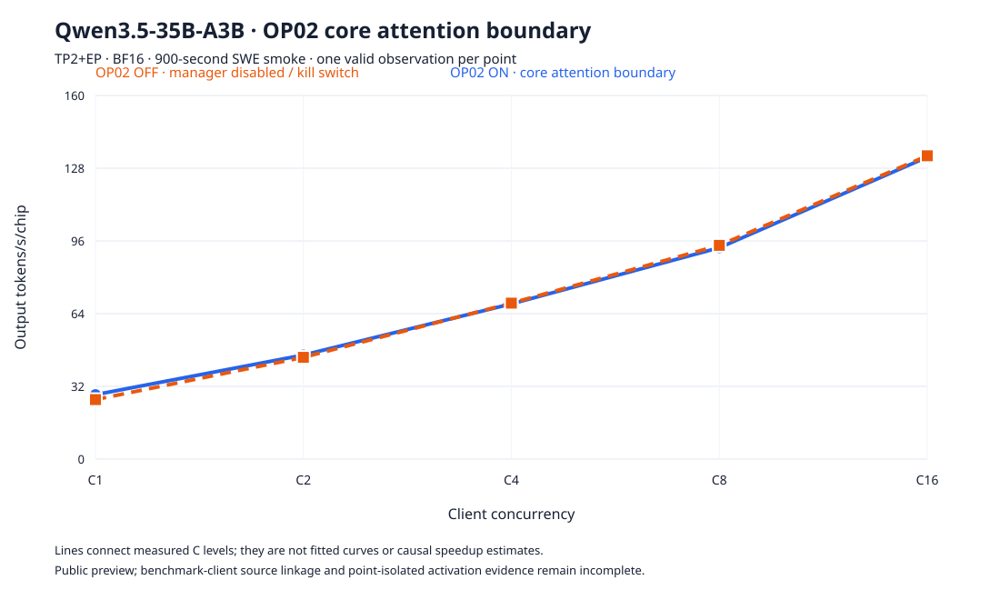

# OP02 core attention boundary · public preview

This document records ten measured, local-only Frontier points for one matched
Qwen3.5-35B-A3B workload: ON and OFF at C1, C2, C4, C8, and C16. This is a
public preview of the protocol evidence, not a causal performance claim. Each
point is one unpooled 900-second observation; the drain is excluded from
latency samples.

## Protocol and identity

- Protocol: `swe-prefix-reuse/v1`, one 20-second protocol probe followed by a
  900-second formal window for each point, TP2+EP, two Ascend 910B2
  accelerators, BF16, `max_model_len=262144`, `max_num_seqs=16`,
  `max_num_batched_tokens=8192`, full decode graphs, and session rotation depth
  1. The client concurrency levels are C1/C2/C4/C8/C16.
- Runtime: vLLM `0.23.0+empty` commit
  `0fc695fc6d1d82e9a5ac6835ac8e4e1c83703665`; vLLM-Ascend `0.23.0.post1`
  commit `1cdb8c4db6e50f36f1fb3283b3e3dd618f6821e8`.
- OP02 package: `vllm-hust-core-attention-boundary` `0.1.0.dev0`, source
  commit `8b5ebb1382bc3624b5250ccec53d5554b6c86003`; Extension Manager
  `0.2.0.dev0`, source commit
  `52e96021c8017938b133ddba895795a13f707568`.
- All ten runs use canonical workload SHA256
  `8044561ffa1bb430bea8f778ef814d96649321e1a92654b95f64263b996d5e85`.
- All ten runs use canonical tokenizer fingerprint
  `3f9ca78537850303ee04bfa6640c020be89723c62f37121c0f27a4c0babc53e0` with
  Transformers `5.17.0`. The server explicitly used the canonical tokenizer
  directory `/root/f01-20261002/canonical-tokenizer-712cf743`.
- All 22 model files, including 14 weight shards, match the existing manifest,
  establishing model revision
  `712cf74392b05026a6db2bf213d343747d1f6d45` and manifest SHA256
  `6238348a1e071f7802cd6a3e808a6ac36592d83fc765872d3a988368b0b144f6`.
  The receipt is
  `docs/evidence/qwen35-mods-k8s-20260925/model-manifest.json`.
- The benchmark revision recorded for these runs is
  `695dd8b1ab280145627a108b434f7a54cca05810`. The canonical run configs do
  not contain a client-source receipt tying that revision to the measured
  process; this linkage remains incomplete.

The measured MOD revision is publicly retrievable at the tag
[`op02-measured-8b5ebb1`](https://github.com/xmdhb/vllm-hust-core-attention-boundary/tree/op02-measured-8b5ebb1),
which resolves anonymously to commit `8b5ebb1382bc3624b5250ccec53d5554b6c86003`.
The catalog entry is published as a preview with `public_surface=true`. The
formal raw artifacts are included under `docs/evidence/qwen35-op02-core-attention-boundary/`.

## Formal observations

`output TPS/chip` is total output tokens per second divided by two participating
accelerators. `decode P90` is the request-level decode throughput percentile;
`TTFT P95` is time to first token. All values below are measured values, not
fitted estimates.

| arm | concurrency | run ID | output TPS | output TPS/chip | decode P90 TPS | TTFT P95 | completed | drained |
| --- | ---: | --- | ---: | ---: | ---: | ---: | ---: | ---: |
| OFF | 1 | `5f0ead007cb449fd8cc90a365cbf975c` | 52.363333 | 26.181667 | 66.093014 | 2550.756 ms | 103 | 1 |
| OFF | 2 | `14bc14425db344c7babb17b03f56e0a0` | 89.555556 | 44.777778 | 60.086382 | 3266.092 ms | 144 | 2 |
| OFF | 4 | `25b101bed670404e8cd0f68620481338` | 137.245556 | 68.622778 | 55.757814 | 3275.091 ms | 204 | 4 |
| OFF | 8 | `c2611445154949e4ad517a431916dbcb` | 188.083333 | 94.041667 | 41.109884 | 3293.576 ms | 308 | 8 |
| OFF | 16 | `3eca9be473b34e3294106d1e5d8b4a5e` | 266.923333 | 133.461667 | 27.616513 | 3993.329 ms | 429 | 16 |
| ON | 1 | `637029d279a94358b95a59b403e152df` | 56.734444 | 28.367222 | 72.894145 | 2469.759 ms | 114 | 1 |
| ON | 2 | `5950550a1f034545488a373779e8f6d` | 91.580000 | 45.790000 | 62.172020 | 3305.608 ms | 147 | 2 |
| ON | 4 | `6beae74d687544e7964ecb8d68e9c602` | 136.610000 | 68.305000 | 55.148555 | 3240.114 ms | 202 | 4 |
| ON | 8 | `02c997e6d22c4a18bd8e3cfa2cbdbab0` | 186.005556 | 93.002778 | 43.058055 | 3258.042 ms | 305 | 8 |
| ON | 16 | `a0f81261b91f43f98839fae72ab7eee6` | 265.774444 | 132.887222 | 27.591005 | 3700.839 ms | 426 | 16 |

All ten formal summaries have `valid=true`, `measurement_seconds=900`,
`failed_requests=0`, and `aborted=false`. The canonical audit reports all
checks passed, and the local archive rechecks every `requests.jsonl` count and
SHA256.

The ON evidence is in one shared service log: it contains four `installed` and
two `runtime_effective` events during service startup/graph capture, before the
first formal ON window. The OFF service log contains no `runtime_effective`
events. Therefore the current evidence proves installation and startup-time
patched execution, but does not isolate a runtime-effective event to each
formal point or prove causal performance attribution.

## Diagnostic curve

The SVG connects the ten measured points at C1/C2/C4/C8/C16 and uses output
tokens per second per chip on the vertical axis. The lines are visual guides,
not fitted curves, confidence intervals, or causal speedup estimates.

## Public raw artifact archive

The canonical formal artifacts are included in this repository under
`docs/evidence/qwen35-op02-core-attention-boundary/`. Each imported run records
SHA256 and byte counts for its `config.json`, `summary.json`, `requests.jsonl`,
the shared service log, and canonical audit. The original local archive remains
the source copy used for verification.

## Admission status

This branch publishes a preview catalog entry and the raw formal artifacts. The
canonical tokenizer/workload and matched C1/C2/C4/C8/C16 ON/OFF measurements
are complete, and the exact MOD revision is publicly pinned by the tag above.
Formal performance admission remains limited by benchmark client-source
linkage and the lack of point-isolated formal-window `runtime_effective`
evidence. The observations must not be presented as proof that OP02 caused a
performance improvement.
